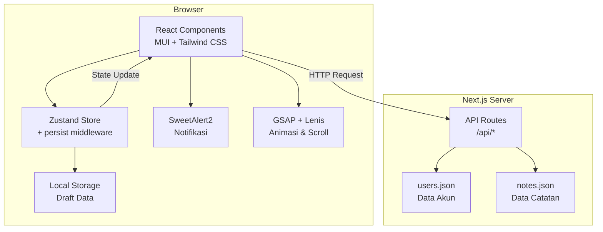
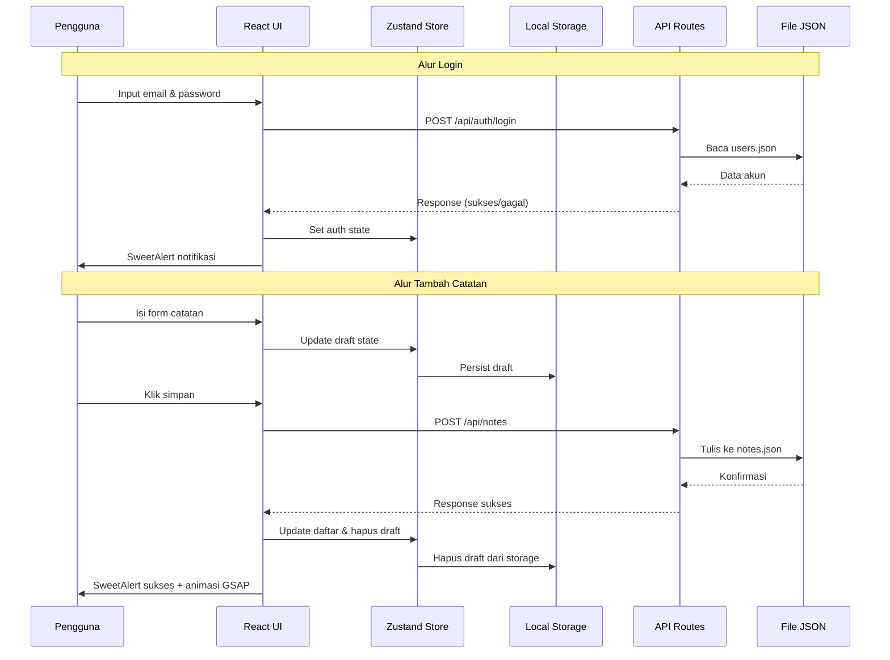

# Dokumen Desain: Shopping Notes App

## Ikhtisar (Overview)

Notes App adalah aplikasi web pencatatan belanjaan yang dibangun dengan Next.js 15, React 19, dan TypeScript. Aplikasi ini memungkinkan pengguna untuk login, mencatat item belanjaan (nama, jumlah, harga), menghitung total harga otomatis dalam format Rupiah, serta mengekspor data ke Excel. Penyimpanan data menggunakan file JSON di server (tanpa database), sementara draft form disimpan di Local Storage melalui Zustand persist middleware. UI dibangun dengan MUI 5 dan Tailwind CSS 3, dilengkapi animasi GSAP dan smooth scrolling Lenis.

### Keputusan Desain Utama

- **Tanpa database**: Data disimpan dalam file JSON di server, cocok untuk aplikasi skala kecil dengan 2 akun terdaftar.
- **Next.js API Routes**: Digunakan sebagai backend untuk operasi CRUD pada file JSON.
- **Zustand + persist**: Mengelola state global dan sinkronisasi draft ke Local Storage.
- **SweetAlert2**: Digunakan untuk semua notifikasi dan dialog konfirmasi, memberikan UX yang konsisten.
- **GSAP + Lenis**: Animasi elemen dan smooth scrolling untuk pengalaman modern.

## Arsitektur (Architecture)

### Diagram Arsitektur



### Alur Data (Data Flow)



### Struktur Folder

```
shopping-notes-app/
├── src/
│   ├── app/
│   │   ├── layout.tsx              # Root layout (provider, Lenis init)
│   │   ├── page.tsx                # Redirect ke /login atau /dashboard
│   │   ├── login/
│   │   │   └── page.tsx            # Halaman login
│   │   ├── forgot-password/
│   │   │   └── page.tsx            # Halaman reset password
│   │   ├── dashboard/
│   │   │   └── page.tsx            # Halaman utama (daftar belanja)
│   │   └── api/
│   │       ├── auth/
│   │       │   ├── login/route.ts
│   │       │   ├── logout/route.ts
│   │       │   └── reset-password/route.ts
│   │       └── notes/
│   │           └── route.ts        # CRUD catatan belanja
│   ├── components/
│   │   ├── NoteForm.tsx            # Form tambah/edit catatan
│   │   ├── NoteCard.tsx            # Card item catatan
│   │   ├── NoteList.tsx            # Daftar catatan
│   │   ├── TotalPrice.tsx          # Tampilan total harga
│   │   ├── ExportButton.tsx        # Tombol ekspor Excel
│   │   └── SweetAlertProvider.tsx  # Wrapper SweetAlert
│   ├── store/
│   │   ├── authStore.ts            # Zustand store autentikasi
│   │   ├── notesStore.ts           # Zustand store catatan belanja
│   │   └── formStore.ts            # Zustand store form draft
│   ├── lib/
│   │   ├── api.ts                  # HTTP client functions
│   │   ├── formatCurrency.ts       # Format Rupiah
│   │   ├── calculateSubtotal.ts    # Hitung subtotal
│   │   ├── calculateTotal.ts       # Hitung total harga
│   │   ├── exportToExcel.ts        # Logika ekspor Excel
│   │   ├── validateNote.ts         # Validasi input catatan
│   │   └── validatePassword.ts     # Validasi password
│   ├── types/
│   │   └── index.ts                # TypeScript interfaces
│   └── animations/
│       ├── gsapAnimations.ts       # Konfigurasi animasi GSAP
│       └── lenisSetup.ts           # Inisialisasi Lenis
├── data/                           # Folder JSON (gitignored)
│   ├── users.json
│   └── notes.json
├── tailwind.config.ts
├── next.config.ts
└── package.json
```

## Komponen dan Antarmuka (Components and Interfaces)

### API Routes

#### `POST /api/auth/login`

- **Input**: `{ email: string, password: string }`
- **Output**: `{ success: boolean, user?: { id: string, email: string }, error?: string }`
- **Logika**: Membaca `users.json`, mencocokkan email dan password, mengembalikan data user jika valid.

#### `POST /api/auth/logout`

- **Input**: Tidak ada body (sesi dikelola di client via Zustand)
- **Output**: `{ success: boolean }`

#### `POST /api/auth/reset-password`

- **Input**: `{ email: string, newPassword: string }`
- **Output**: `{ success: boolean, error?: string }`
- **Logika**: Validasi email terdaftar, validasi panjang password minimal 8 karakter, update password di `users.json`.

#### `GET /api/notes?userId={userId}`

- **Output**: `{ notes: ShoppingNote[] }`
- **Logika**: Membaca `notes.json`, filter berdasarkan `userId`.

#### `POST /api/notes`

- **Input**: `{ userId: string, itemName: string, quantity: number, unitPrice: number }`
- **Output**: `{ success: boolean, note: ShoppingNote }`
- **Logika**: Validasi input, hitung subtotal, simpan ke `notes.json` dengan ID unik.

#### `PUT /api/notes`

- **Input**: `{ id: string, itemName: string, quantity: number, unitPrice: number }`
- **Output**: `{ success: boolean, note: ShoppingNote }`
- **Logika**: Cari catatan berdasarkan ID, update data, hitung ulang subtotal.

#### `DELETE /api/notes?id={id}`

- **Output**: `{ success: boolean }`
- **Logika**: Hapus catatan berdasarkan ID dari `notes.json`.

### Komponen React

| Komponen       | Props                                                                                                         | Deskripsi                                           |
| -------------- | ------------------------------------------------------------------------------------------------------------- | --------------------------------------------------- |
| `NoteForm`     | `mode: 'create' \| 'edit'`, `initialData?: ShoppingNote`, `onSubmit: (data) => void`, `onCancel?: () => void` | Form untuk tambah/edit catatan belanja              |
| `NoteCard`     | `note: ShoppingNote`, `onEdit: (id) => void`, `onDelete: (id) => void`                                        | Card yang menampilkan satu item catatan             |
| `NoteList`     | `notes: ShoppingNote[]`, `onEdit: (id) => void`, `onDelete: (id) => void`                                     | Daftar semua catatan belanja dengan animasi GSAP    |
| `TotalPrice`   | `total: number`                                                                                               | Menampilkan total harga dalam format Rupiah         |
| `ExportButton` | `notes: ShoppingNote[]`, `disabled: boolean`                                                                  | Tombol ekspor ke Excel, disabled jika daftar kosong |

### Zustand Stores

#### `authStore`

```typescript
interface AuthState {
  isLoggedIn: boolean;
  user: User | null;
  login: (email: string, password: string) => Promise<boolean>;
  logout: () => void;
}
```

#### `notesStore`

```typescript
interface NotesState {
  notes: ShoppingNote[];
  totalPrice: number;
  fetchNotes: (userId: string) => Promise<void>;
  addNote: (note: CreateNoteInput) => Promise<void>;
  updateNote: (id: string, data: UpdateNoteInput) => Promise<void>;
  deleteNote: (id: string) => Promise<void>;
}
```

#### `formStore`

```typescript
interface FormState {
  draft: DraftNote | null;
  editingId: string | null;
  setDraft: (draft: DraftNote) => void;
  clearDraft: () => void;
  setEditingId: (id: string | null) => void;
}
// Menggunakan persist middleware untuk sinkronisasi ke Local Storage
```

### Fungsi Utilitas (lib/)

| Fungsi              | Signature                                         | Deskripsi                                    |
| ------------------- | ------------------------------------------------- | -------------------------------------------- |
| `formatCurrency`    | `(amount: number) => string`                      | Format angka ke "Rp 1.000.000"               |
| `calculateSubtotal` | `(quantity: number, unitPrice: number) => number` | Hitung subtotal: quantity × unitPrice        |
| `calculateTotal`    | `(notes: ShoppingNote[]) => number`               | Jumlahkan semua subtotal                     |
| `exportToExcel`     | `(notes: ShoppingNote[]) => void`                 | Generate dan download file .xlsx             |
| `validateNote`      | `(input: CreateNoteInput) => ValidationResult`    | Validasi field catatan (nama, jumlah, harga) |
| `validatePassword`  | `(password: string) => ValidationResult`          | Validasi password (min 8 karakter)           |

## Model Data (Data Models)

### TypeScript Interfaces

```typescript
// === Entitas Utama ===

interface User {
  id: string;
  email: string;
  password: string; // Disimpan plain text di JSON (sesuai scope aplikasi sederhana)
}

interface ShoppingNote {
  id: string;
  userId: string;
  itemName: string;
  quantity: number; // Bilangan bulat positif
  unitPrice: number; // Dalam Rupiah, bilangan positif
  subtotal: number; // quantity × unitPrice (dihitung otomatis)
  createdAt: string; // ISO 8601 timestamp
  updatedAt: string; // ISO 8601 timestamp
}

// === Input Types ===

interface CreateNoteInput {
  userId: string;
  itemName: string;
  quantity: number;
  unitPrice: number;
}

interface UpdateNoteInput {
  itemName: string;
  quantity: number;
  unitPrice: number;
}

interface LoginInput {
  email: string;
  password: string;
}

interface ResetPasswordInput {
  email: string;
  newPassword: string;
}

// === Draft & Form ===

interface DraftNote {
  itemName: string;
  quantity: string; // String karena dari input field
  unitPrice: string; // String karena dari input field
}

// === Validasi ===

interface ValidationResult {
  valid: boolean;
  errors: string[];
}

// === API Response ===

interface ApiResponse<T = unknown> {
  success: boolean;
  data?: T;
  error?: string;
}
```

### Struktur File JSON

#### `data/users.json`

```json
[
  {
    "id": "user-1",
    "email": "rezzabagus.rb@gmail.com",
    "password": "Kapanpundimanapun"
  },
  {
    "id": "user-2",
    "email": "ritakarina12@gmail.com",
    "password": "Jakarta021096"
  }
]
```

#### `data/notes.json`

```json
[
  {
    "id": "note-abc123",
    "userId": "user-1",
    "itemName": "Beras 5kg",
    "quantity": 2,
    "unitPrice": 65000,
    "subtotal": 130000,
    "createdAt": "2025-01-15T10:30:00.000Z",
    "updatedAt": "2025-01-15T10:30:00.000Z"
  }
]
```

### Format Ekspor Excel

File `.xlsx` yang dihasilkan memiliki kolom:

| No  | Nama Item | Jumlah | Harga Satuan (Rp) | Subtotal (Rp)  |
| --- | --------- | ------ | ----------------- | -------------- |
| 1   | Beras 5kg | 2      | 65.000            | 130.000        |
| ... | ...       | ...    | ...               | ...            |
|     |           |        | **Total**         | **Rp 130.000** |

Nama file: `Daftar_Belanja_2025-01-15.xlsx`

## Properti Kebenaran (Correctness Properties)

_Properti kebenaran adalah karakteristik atau perilaku yang harus berlaku di semua eksekusi valid dari sebuah sistem — pada dasarnya, pernyataan formal tentang apa yang seharusnya dilakukan sistem. Properti berfungsi sebagai jembatan antara spesifikasi yang dapat dibaca manusia dan jaminan kebenaran yang dapat diverifikasi mesin._

### Property 1: Autentikasi login hanya menerima kredensial yang cocok

_Untuk semua_ pasangan (email, password), fungsi autentikasi login mengembalikan sukses jika dan hanya jika email dan password cocok dengan salah satu akun yang terdaftar di data pengguna.

**Validates: Requirements 1.2, 1.3**

### Property 2: Reset password hanya berhasil untuk email terdaftar dengan password valid

_Untuk semua_ email dan password baru, operasi reset password berhasil jika dan hanya jika email terdaftar di data pengguna DAN password baru memiliki panjang minimal 8 karakter.

**Validates: Requirements 2.2, 2.3**

### Property 3: Validasi password berdasarkan panjang minimal

_Untuk semua_ string, `validatePassword` mengembalikan valid jika dan hanya jika panjang string >= 8 karakter.

**Validates: Requirements 2.4**

### Property 4: Validasi catatan menolak input dengan field kosong

_Untuk semua_ `CreateNoteInput`, `validateNote` mengembalikan valid jika dan hanya jika `itemName` tidak kosong (setelah trim), `quantity` adalah bilangan positif, dan `unitPrice` adalah bilangan positif.

**Validates: Requirements 3.3**

### Property 5: Kalkulasi subtotal adalah perkalian jumlah dan harga satuan

_Untuk semua_ pasangan (quantity, unitPrice) berupa bilangan positif, `calculateSubtotal(quantity, unitPrice)` mengembalikan nilai yang sama dengan `quantity × unitPrice`.

**Validates: Requirements 3.4, 4.4**

### Property 6: Kalkulasi total adalah penjumlahan seluruh subtotal

_Untuk semua_ array `ShoppingNote[]`, `calculateTotal(notes)` mengembalikan nilai yang sama dengan penjumlahan seluruh `note.subtotal` dalam array tersebut.

**Validates: Requirements 6.1**

### Property 7: Format mata uang Rupiah dengan pemisah ribuan

_Untuk semua_ bilangan non-negatif, `formatCurrency(amount)` mengembalikan string yang dimulai dengan "Rp ", diikuti angka dengan pemisah titik setiap 3 digit dari kanan, dan jika di-parse kembali (hapus "Rp " dan titik) menghasilkan angka asli.

**Validates: Requirements 6.3**

### Property 8: Ekspor Excel menghasilkan file dengan kolom lengkap dan nama file benar

_Untuk semua_ array `ShoppingNote[]` yang tidak kosong dan tanggal apapun, `exportToExcel` menghasilkan file yang berisi kolom nama item, jumlah, harga satuan, subtotal, dan total keseluruhan, dengan nama file mengikuti format `Daftar_Belanja_YYYY-MM-DD.xlsx`.

**Validates: Requirements 7.2, 7.4**

### Property 9: Round-trip persistensi draft di Local Storage

_Untuk semua_ `DraftNote`, setelah `setDraft(draft)` dipanggil, membaca draft dari store mengembalikan data yang identik. Selanjutnya, setelah `clearDraft()` dipanggil, draft menjadi `null`.

**Validates: Requirements 8.1, 8.2, 8.3**

### Property 10: Durasi animasi GSAP dalam rentang yang konsisten

_Untuk semua_ konfigurasi animasi GSAP yang didefinisikan dalam aplikasi, nilai durasi berada dalam rentang 300ms hingga 600ms (inklusif).

**Validates: Requirements 9.5**

## Penanganan Error (Error Handling)

### Strategi Penanganan Error

| Skenario                                 | Penanganan                                 | Notifikasi                                       |
| ---------------------------------------- | ------------------------------------------ | ------------------------------------------------ |
| Login gagal (kredensial salah)           | Return error dari API, state tidak berubah | SweetAlert error: "Email atau password salah"    |
| Reset password - email tidak ditemukan   | Return error dari API                      | SweetAlert error: "Email tidak ditemukan"        |
| Reset password - password terlalu pendek | Validasi client-side sebelum kirim         | SweetAlert error: "Password minimal 8 karakter"  |
| Simpan catatan - field kosong            | Validasi client-side, blokir submit        | SweetAlert warning: "Semua field wajib diisi"    |
| Simpan catatan - gagal tulis JSON        | Return 500 dari API                        | SweetAlert error: "Gagal menyimpan catatan"      |
| Hapus catatan - gagal                    | Return 500 dari API                        | SweetAlert error: "Gagal menghapus catatan"      |
| Ekspor Excel - daftar kosong             | Cek di client sebelum proses               | SweetAlert info: "Tidak ada data untuk diekspor" |
| File JSON tidak ditemukan/corrupt        | API membuat file baru dengan array kosong  | Log error di server console                      |
| Local Storage penuh/tidak tersedia       | Zustand persist gagal secara silent        | Aplikasi tetap berfungsi tanpa draft persistence |
| Network error (API tidak responsif)      | Catch di client HTTP layer                 | SweetAlert error: "Terjadi kesalahan jaringan"   |

### Validasi Input

- **Email**: Format email valid (regex sederhana)
- **Password**: Minimal 8 karakter
- **Nama Item**: Tidak boleh kosong (setelah trim)
- **Jumlah**: Bilangan bulat positif (> 0)
- **Harga Satuan**: Bilangan positif (> 0)

### Error Boundary

- Implementasi React Error Boundary di root layout untuk menangkap error rendering yang tidak terduga
- Fallback UI menampilkan pesan "Terjadi kesalahan" dengan tombol refresh

## Strategi Pengujian (Testing Strategy)

### Pendekatan Pengujian Ganda

Aplikasi ini menggunakan kombinasi unit test (contoh spesifik) dan property-based test (properti universal) untuk cakupan yang komprehensif.

### Library yang Digunakan

- **Vitest**: Test runner utama (kompatibel dengan Next.js)
- **fast-check**: Library property-based testing untuk TypeScript
- **React Testing Library**: Testing komponen React
- **MSW (Mock Service Worker)**: Mocking API calls (opsional)

### Property-Based Tests

Setiap property test harus dikonfigurasi dengan minimal **100 iterasi**.

Setiap test harus diberi tag dengan format:
`Feature: shopping-notes-app, Property {number}: {property_text}`

| Property    | Fungsi yang Diuji                          | Generator Input                                     |
| ----------- | ------------------------------------------ | --------------------------------------------------- |
| Property 1  | `authenticate(email, password, users)`     | Random string pairs + known valid pairs             |
| Property 2  | `resetPassword(email, newPassword, users)` | Random emails + random passwords (varying length)   |
| Property 3  | `validatePassword(password)`               | Random strings (0-100 chars)                        |
| Property 4  | `validateNote(input)`                      | Random CreateNoteInput dengan field kosong/terisi   |
| Property 5  | `calculateSubtotal(quantity, unitPrice)`   | Random positive integers/floats                     |
| Property 6  | `calculateTotal(notes)`                    | Random arrays of ShoppingNote                       |
| Property 7  | `formatCurrency(amount)`                   | Random non-negative numbers                         |
| Property 8  | `exportToExcel(notes, date)`               | Random non-empty ShoppingNote arrays + random dates |
| Property 9  | `formStore.setDraft / clearDraft`          | Random DraftNote objects                            |
| Property 10 | Konfigurasi animasi GSAP                   | Semua animasi yang didefinisikan                    |

### Unit Tests (Example-Based)

Unit test fokus pada contoh spesifik, edge case, dan integrasi:

- **Autentikasi**: Login dengan 2 akun yang diketahui, logout, redirect behavior
- **Routing**: Redirect ke login tanpa sesi, redirect ke dashboard setelah login
- **Komponen UI**: Render form, card, list dengan data contoh
- **SweetAlert**: Notifikasi muncul untuk setiap operasi (sukses, error, konfirmasi)
- **Animasi**: Elemen baru memiliki animasi masuk, elemen dihapus memiliki animasi keluar
- **Responsif**: Snapshot test pada viewport desktop (1024px) dan mobile (360px)
- **Edge cases**: Ekspor dengan daftar kosong, input dengan karakter spesial, angka sangat besar

### Integration Tests

- **API Routes**: Test CRUD operations pada `/api/notes` dengan file JSON test
- **Auth Flow**: Test alur login → dashboard → logout end-to-end
- **Reset Password Flow**: Test alur reset password → login dengan password baru
- **Ekspor Excel**: Test generate file .xlsx dan verifikasi konten

### Struktur File Test

```
src/
├── lib/
│   ├── __tests__/
│   │   ├── formatCurrency.test.ts        # Property 7 + unit tests
│   │   ├── calculateSubtotal.test.ts     # Property 5 + unit tests
│   │   ├── calculateTotal.test.ts        # Property 6 + unit tests
│   │   ├── validateNote.test.ts          # Property 4 + unit tests
│   │   ├── validatePassword.test.ts      # Property 3 + unit tests
│   │   └── exportToExcel.test.ts         # Property 8 + unit tests
├── store/
│   ├── __tests__/
│   │   ├── authStore.test.ts             # Property 1, 2 + unit tests
│   │   └── formStore.test.ts             # Property 9 + unit tests
├── animations/
│   ├── __tests__/
│   │   └── gsapAnimations.test.ts        # Property 10 + unit tests
├── app/
│   └── api/
│       ├── auth/__tests__/
│       │   └── auth.integration.test.ts  # Integration tests
│       └── notes/__tests__/
│           └── notes.integration.test.ts # Integration tests
└── components/
    └── __tests__/
        ├── NoteForm.test.tsx
        ├── NoteCard.test.tsx
        ├── NoteList.test.tsx
        └── ExportButton.test.tsx
```
